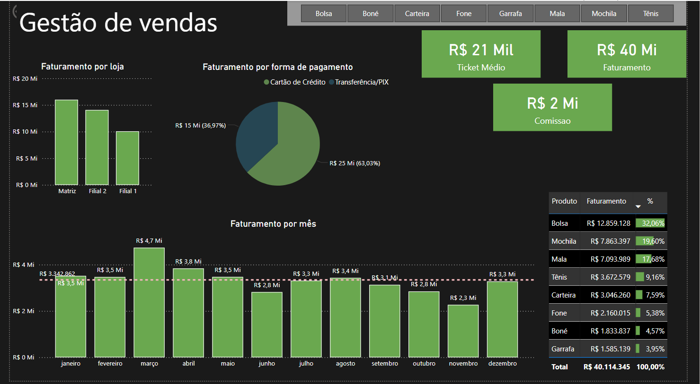

# 📊 Gestão de Vendas - Dashboard em Power BI

Este projeto apresenta um **dashboard interativo** desenvolvido no **Power BI Desktop** com foco na análise de **faturamento**, **ticket médio**, **comissão** e **desempenho por loja/produto**.

## 🎯 Objetivo

O objetivo deste dashboard é fornecer uma **visão gerencial** clara e objetiva sobre os principais indicadores de vendas de uma empresa, permitindo que gestores tomem decisões baseadas em dados.

---

## 📌 Indicadores e Análises

### ✅ Visões disponíveis:

- **Faturamento por mês**  
  Visualização mensal do valor total de vendas, com **linha de referência de média** destacada.
  
- **Faturamento por loja**  
  Comparativo de desempenho entre **Matriz, Filial 1 e Filial 2**.

- **Faturamento por forma de pagamento**  
  Distribuição entre **Cartão de Crédito** e **Transferência/PIX**.

- **Ticket médio**
- **Comissão**
- **Ranking de produtos vendidos** com destaque percentual.

---

## 🛠️ Tecnologias Utilizadas

- Power BI Desktop
- DAX (para medidas calculadas)
- Formatação condicional
- Linha de referência com média

## 📷 Screenshot

---

